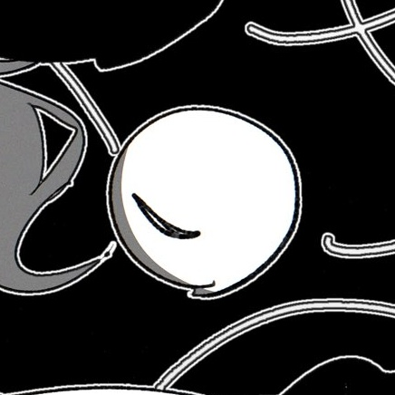

<h1 align="center">koisee</h1>

Let Koishi do her best finding images for you 🌸

    

## what is this?

**koisee** is a small, experimental tool that helps you find duplicate or similar images in folders.

she's still learning, so she isn't available yet... please wait warmly while she's preparing

## future...

koisee wants to:

- support gifs, videos and audio
- becoming faster and less memory intensive
- learn how to use profilers and flamegraphs for the above...

though images are the main focus!
